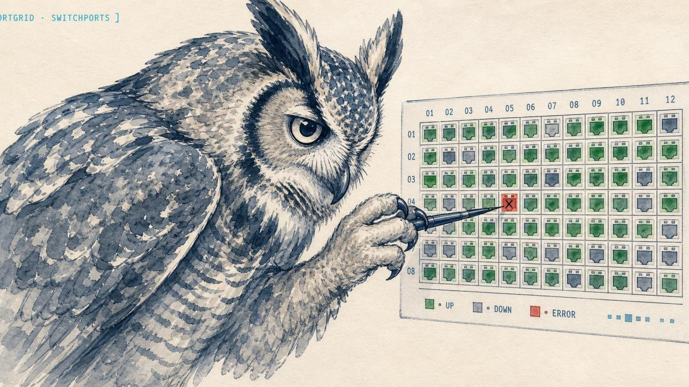

<p align="center">
  
</p>

<h1 align="center">🌐 Solomon's PortGrid</h1>

<p align="center"><strong>High-density switch port visualizer for LibreNMS with real-time status and VLAN mapping.</strong></p>

<p align="center">
  <a href="https://solomonneas.dev/projects/portgrid-network-visualization">solomonneas.dev</a>
</p>

<p align="center">
  
  
  
  
  
  
</p>

PortGrid is a network dashboard that transforms dense port tables into a scannable, color-coded grid view. See all your switch ports at a glance, search by description or MAC address, and track VLAN assignments in real-time.


---

## Features

- **Color-Coded Status** - Green (up), amber (inactive), red (disabled) at a glance
- **High-Density Grid** - See 48+ ports per switch on one screen
- **Device Grouping** - Organize switches into collapsible groups
- **Global Search** - Find ports by description, MAC address, IP, or VLAN
- **VLAN Mapping** - Filter ports by VLAN assignment
- **Neighbor Detection** - LLDP/CDP peers displayed inline
- **Auto-Refresh** - Updates every 60 seconds from LibreNMS API
- **Dark/Light Mode** - Toggle themes
- **Responsive Design** - Works on desktop and mobile
- **Drag-Drop Grouping** - Combine switches into custom groups (saved locally)

---

## Quick Start

```bash
# Clone and install
git clone https://github.com/lidless-labs/portgrid.git
cd portgrid

# Install dependencies
npm install

# Configure LibreNMS connection
cp .env.local.example .env.local
# Edit .env.local with your LibreNMS host and API token

# Start dev server
npm run dev
```

Open **http://localhost:5184** in your browser

---

## Configuration

### Environment Variables

Edit `.env.local`:

```bash
NEXT_PUBLIC_LIBRENMS_HOST=https://librenms.example.com
LIBRENMS_API_TOKEN=your-api-token-here
NEXT_PUBLIC_REFRESH_INTERVAL=60000
NEXT_PUBLIC_PORT_PAGE_SIZE=48
```

| Variable | Description | Default |
|----------|-------------|---------|
| `NEXT_PUBLIC_LIBRENMS_HOST` | LibreNMS server URL | (required) |
| `LIBRENMS_API_TOKEN` | API token (keep secret) | (required) |
| `NEXT_PUBLIC_REFRESH_INTERVAL` | Auto-refresh interval (ms) | 60000 |
| `NEXT_PUBLIC_PORT_PAGE_SIZE` | Ports per page in grid | 48 |

### LibreNMS API Token

1. Log in to LibreNMS
2. Settings > API > Create API Token
3. Copy token to `.env.local`

---

## Tech Stack

| Layer | Technology | Purpose |
|-------|-----------|---------|
| **Framework** | Next.js 15 | React framework with API routes |
| **Runtime** | React 19 | Component library |
| **Language** | TypeScript 5 | Type safety |
| **Styling** | Tailwind CSS 4 | Utility-first CSS |
| **State** | Zustand + TanStack Query | Client state and server queries |
| **API** | LibreNMS REST API | Data source for port status |
| **Icons** | Lucide React | Consistent icon set |

---

## Port Status Indicators

| Color | Meaning | Details |
|-------|---------|---------|
| **Green** | Up | Port is active and operational |
| **Amber** | Inactive | Port is configured but idle |
| **Red** | Disabled | Port is administratively disabled |
| **Gray** | Unknown | No status data received |

Hover over a port to see:
- Port name
- Current VLAN
- MAC addresses on port
- Connected neighbors (LLDP/CDP)
- Traffic stats (bytes in/out)

---

## Grouping Devices

Organize related switches:

1. **Create Group** - Drag one switch onto another
2. **Add to Group** - Drag more switches into the group
3. **Rename** - Click group title to edit
4. **Ungroup** - Drag switch out to main list

Groups are saved to localStorage and persist across sessions.

---

## Search & Filter

### Search

Press `Ctrl+K` or click the search box. Search by:
- **Port name** - "eth0", "Gi0/0/1"
- **Description** - "Server uplink", "Guest WiFi"
- **MAC address** - "aa:bb:cc:dd:ee:ff"
- **IP address** - "192.0.2.10"
- **VLAN** - "vlan 100"

### Filter by VLAN

Click **VLANs** sidebar to:
- Filter all ports by VLAN
- See VLAN statistics
- Hide VLANs from view

---

## Project Structure

```text
portgrid/
├── app/
│   ├── page.tsx              # Dashboard home
│   ├── layout.tsx            # Root layout
│   ├── api/
│   │   ├── ports/route.ts    # Fetch ports from LibreNMS
│   │   └── devices/route.ts  # Fetch device list
│   └── components/
│       ├── PortGrid.tsx      # Grid view
│       ├── DeviceGroup.tsx   # Collapsible groups
│       ├── Search.tsx        # Search bar
│       └── StatusIndicator.tsx
├── lib/
│   ├── librenms.ts           # API client
│   ├── store.ts              # Zustand state
│   └── utils.ts              # Helpers
├── types/
│   └── index.ts              # TypeScript interfaces
├── public/
├── .env.local.example
├── next.config.ts
└── package.json
```

---

## LibreNMS API Integration

PortGrid fetches data from these LibreNMS endpoints:

**GET /api/v0/devices**
List all monitored devices.

**GET /api/v0/devices/{device_id}/ports**
Get all ports for a device with status.

**GET /api/v0/devices/{device_id}/vlans**
Get VLAN assignments for ports.

**GET /api/v0/ports?columns=*&limit=0**
Advanced port queries (status, traffic, neighbors).

See [LibreNMS API docs](https://docs.librenms.org/API/Ports/) for full reference.

---

## Keyboard Shortcuts

| Key | Action |
|-----|--------|
| `Ctrl+K` / `Cmd+K` | Open search |
| `Esc` | Close search or dialogs |
| `?` | Show help |
| `L` | Toggle light/dark mode |
| `G` | Focus group management |

---

## License

MIT - see [LICENSE](LICENSE) for details.
